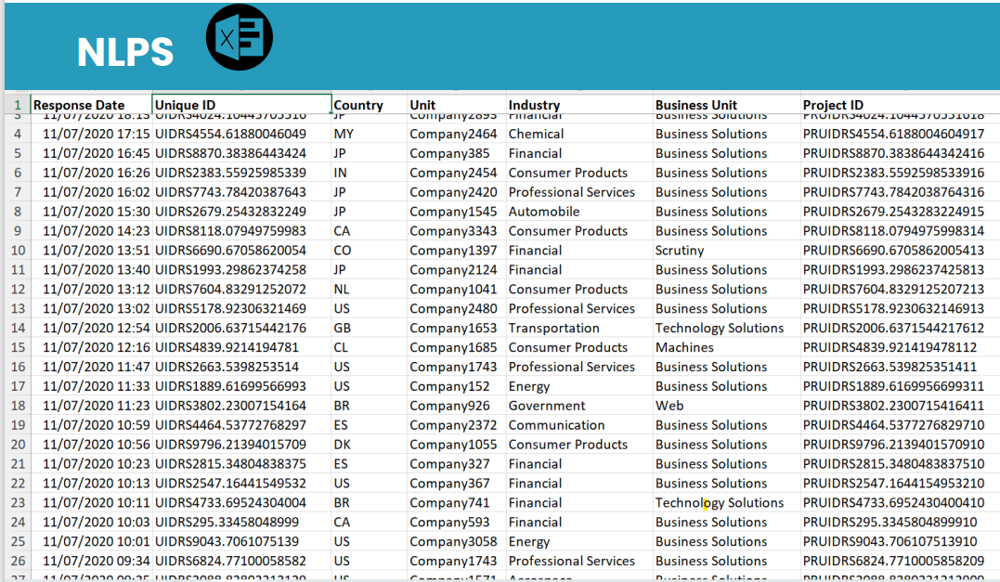
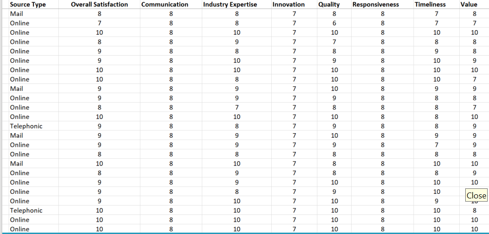
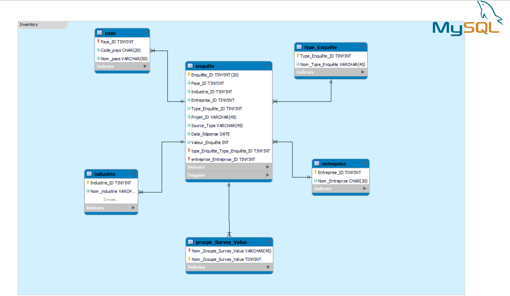
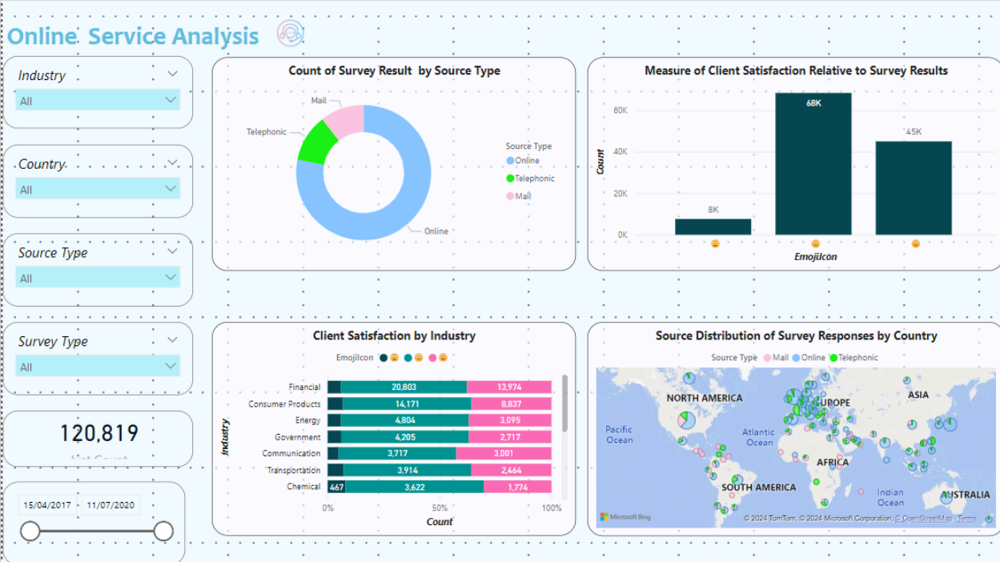
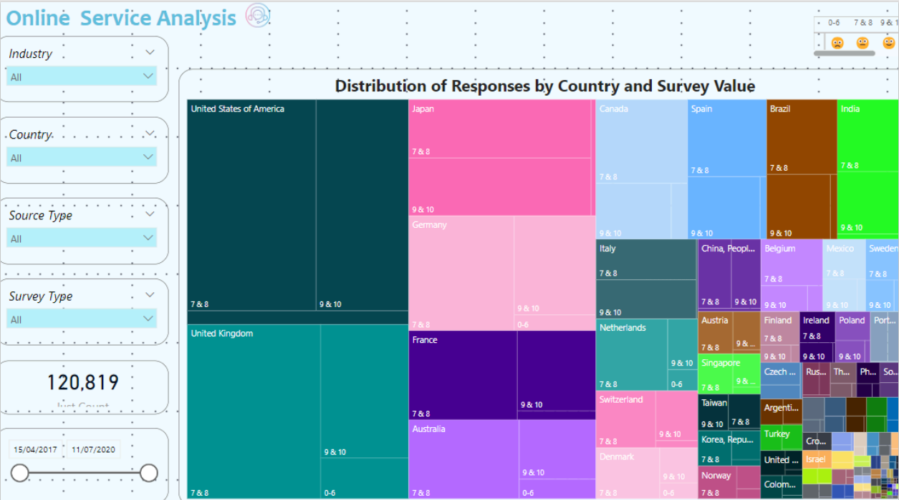
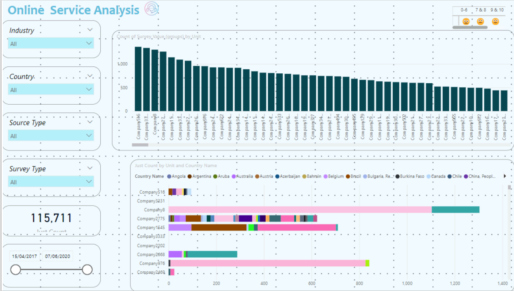

# Sentiment Analysis of Online Services using Power BI and Machine Learning

## Project Overview

This project aims to study client satisfaction and sentiment analysis about online services for various industries using machine learning techniques and visualize the results with Power BI. By examining customer feedback, we can gain insights into customer satisfaction and identify areas for improvement.


## Data Collection

The data for this project was collected from Kaggle. The dataset includes text data with customer comments and ratings, providing a rich source of information for sentiment analysis.






This ensures that the text data is in a suitable format for sentiment analysis.


## Sentiment Analysis Model

We used a machine learning model to classify the sentiments of the customer comments into positive, negative, and neutral categories. The steps involved are:

1. **Feature Extraction:** Converting text data into numerical features using techniques like TF-IDF (Term Frequency-Inverse Document Frequency).
2. **Model Training:** Training a classifier (e.g., Logistic Regression, Random Forest) on the preprocessed data.
3. **Evaluation:** Assessing the model's performance using metrics like accuracy, precision, recall, and F1-score.


## Datawarehouse
Using MySQL Workebench:



## Visualization with Power BI

The results of the sentiment analysis were visualized using Power BI. This allows us to create interactive dashboards that provide insights into customer sentiments. Key visualizations include:






## How to Use

1. **Clone the Repository:**
    ```bash
    git clone https://github.com/yourusername/airline-sentiment-analysis.git
    ```

2. **Install Dependencies:**
    ```bash
    pip install -r requirements.txt
    ```

3. **Run the Sentiment Analysis Script:**
    ```bash
    python sentiment_analysis.py
    ```

4. **Open Power BI:**
    - Load the resulting sentiment data into Power BI.
    - Use the provided Power BI template (`.pbix` file) to visualize the data.

## Results

The sentiment analysis revealed the following insights:

- Clients are most satisfied with the financial and consumer goods industries.
- Clients are most satisfied with responses from North America and Asia.
- Clients are most satisfied with responses received online and by phone.
- Clients are most satisfied with email surveys.


## Conclusion

By leveraging machine learning and Power BI, we were able to gain valuable insights into customer sentiments. This analysis can help the industries to improve its online services and enhance customer satisfaction.

## References

- [Natural Language Toolkit (NLTK)](https://www.nltk.org/)
- [scikit-learn Documentation](https://scikit-learn.org/stable/documentation.html)
- [Power BI Documentation](https://docs.microsoft.com/en-us/power-bi/)


